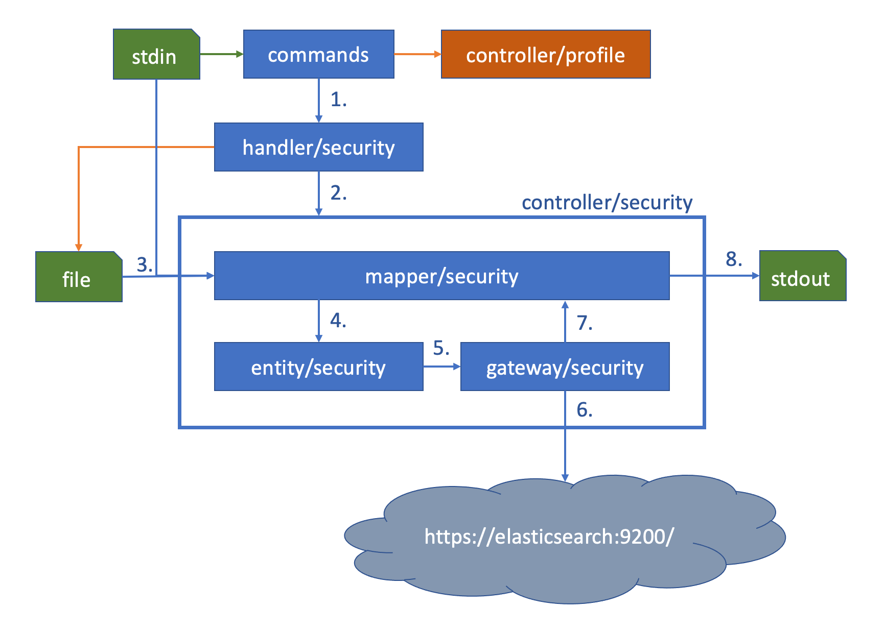

# Implementation

This document describes the implementation detail for `odfe-cli security` command. Includes all the files added and packages defined to support such feature.

---

## Code overview

### Packages

`Packages` are the smallest unit of importable code in `go`. Listed packages are added to `odfe-cli` for supporting features interacting with security plugin.

Package | Description
--------|-------------
`handler/security` | Codes that are responsible to route execution flow to desired `controller`. Responsible for parsing command line arguments and flags
`controller/security` | Glue code depends on following 3 packages. Responsible for loading input and invoke required functions in its dependency. As well as outputting final result to `stdout`
`mapper/security` | Responsible for parsing input into consumable `struct`. And refactor response body into desired output format
`entity/security` | Package holding all custom structure defined for this implementation
`gateway/security` | Codes responsible connecting to `elasticsearch` cluster

---

## Architecture

The Program is shown in the attached diagram

Explanation for each step:

1. `commands` package parses command line input and route execution to our code implemented in `commands/security.go`. The code tries to find `odfe-cli` profile with utilities provided by `odfe-cli` team defined in `controller/profile`. It passes `*entity.Profile` pointer into functions from `handler/security`.
2. `handler/security` routes in coming commands to proper controller function defined in `controller/security`. Based on command flags, handler will create `io.Reader` and pass it into `controller/security`.
3. `controller/security` reads input into `mapper/security` if needed. It reads from `io.Reader` supplied by `handler/security`
4. `mapper/security` parses loaded file or other required input into structures defined in `entity/security`.
5. Parsed structures passed into `gateway/security`.
6. `gateway/security` executes request to `elasticsearch` cluster, which has `security-plugin` installed and enabled.
7. `gateway/security` returns http response from cluster into `mapper/security`.
8. `mapper/security` re-structures into desired output format and `controller/security` print it to standard output.
